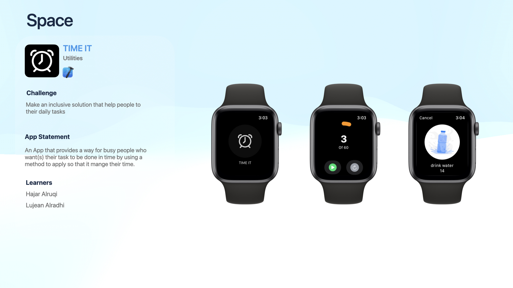

# TIME IT

## Table of Contents
  * [Big Idea](#Big Idea)
  * [Challenge Statement](#Challenge Statement)
  * [Solution Concept](#Solution Concept)
  * [Technology & Tools](#Technology & Tools)
  * [Demo](#Demo)
  * [Challenge Summary](#Challenge Summary)
  * [Questions](#Questions)

## Big Idea
Inclusion

## Challenge Statement 
help people to track their daily tasks

## Solution Concept
An app that provides a 60|15 timer to help people manage their time in an efficient way

## Technology & Tools
[![Swift][Swift-img]][Swift-url]   [![Sketch][Sketch-img]][Sketch-url]

## Demo

## Challenge Summary 

      
## Questions
      
  _For further questions:_

  If you have any questions, or additional feedback, please feel free to email me and I will respond as soon as possible.
  
  _Contact Info:_
  Space Team (8)
<a href="https://github.com/Lujean99">Lujean Alradhi</a> - <a href="https://github.com/nhajarn">Hajar Alruqi</a> 

  <!-- MARKDOWN LINKS & IMAGES -->
<!-- https://www.markdownguide.org/basic-syntax/#reference-style-links -->
[Swift-img]: https://img.shields.io/badge/-SwiftUi-orange
[Swift-url]: https://developer.apple.com/swift/

[Sketch-img]: https://img.shields.io/badge/-Sketch-orange
[Sketch-url]: https://www.sketch.com/
